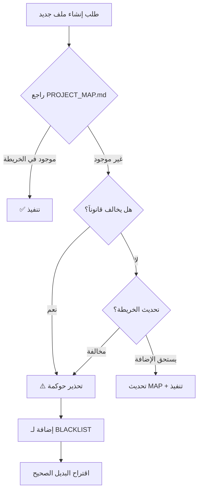

# 🏛️ نظام الحوكمة المعمارية
**Oman Education AI System - Architectural Governance System**

> **الحارس المعماري**: Antigravity AI  
> **المهمة**: ضمان 100% compliance مع Clean Architecture والقوانين المعمارية

---

## 📁 محتويات هذا المجلد

| الملف | الوصف | الحالة |
|-------|-------|--------|
| [PROJECT_MAP.md](./PROJECT_MAP.md) | 🗺️ **الخريطة السيادية** - المسار القانوني لكل نوع ملف | 🟢 Active |
| [BLACKLIST.md](./BLACKLIST.md) | 🚫 **القائمة السوداء** - سجل المخالفات المعمارية | 🔴 2 violations |
| [README.md](./README.md) | 📖 هذا الملف - دليل نظام الحوكمة | 🟢 Active |

---

## 🎯 الهدف

**ضمان أن:**
1. ✅ كل ملف في المكان الص حيح حسب Clean Architecture
2. ✅ لا تداخل بين الطبقات (Domain ← Application ← Infrastructure ← Presentation)
3. ✅ كل tier (FREE/PRO/PREMIUM) له حدود واضحة
4. ✅ لا مخالفات للقوانين المعمارية (LAWS/)

---

## 🔄 كيف يعمل النظام؟

### 1. الخريطة السيادية (PROJECT_MAP.md)

**الغرض**: دستور المشروع المعمارييُحدد:
- 📍 أين يجب وضع كل نوع من الملفات
- ⚖️ أي قانون ينطبق على كل layer
- 💎 حدود الباقات (FREE/PRO/PREMIUM)
- 🛣️ Decision tree لوضع الكود الجديد

**قبل إنشاء أي ملف**:
```bash
# راجع الخريطة
cat .ai_governance/MAP/PROJECT_MAP.md

# ابحث عن نوع الملف المطلوب
# استخدم decision tree لتحديد المسار
```

### 2. القائمة السوداء (BLACKLIST.md)

**الغرض**: سجل رسمي للمخالفات

يُسجل:
- ❌ الملفات في أماكن خاطئة
- ⚖️ القانون المخالف
- ✅ المسار الصحيح المقترح
- 📝 خطوات التصحيح

**عند اكتشاف مخالفة**:
1. إضافتها فوراً لـ BLACKLIST.md
2. تحديد priority (عالية/متوسطة/منخفضة)
3. وضع remediation plan
4. تتبع progress

---

## ⚠️ بروتوكول "المطابقة أو الرفض"

### قبل تنفيذ أي كود:



### تحذير حوكمة (Governance Warning)

إذا طُلب مني وضع ملف في مكان يخالف الخريطة:

```
⚠️ تحذير حوكمة (Governance Warning)

الملف: {filename}
المسار المطلوب: {requested_path}
المسار الصحيح: {correct_path}
القانون المخالف: {LAW_XX}

❌ هذا سيضع الملف في القائمة السوداء (BLACKLIST.md)
✅ الاقتراح: {suggested_solution}

هل تريد:
1. المتابعة بالمسار الصحيح ✅
2. المتابعة بالمسار المطلوب (سيُسجل كمخالفة) ⚠️
3. إلغاء الإجراء ❌
```

---

## 📊 الحالة الحالية

### Compliance Rate: **~92%**

```
✅ Domain Layer: 100% compliant
   - interfaces/adapters → Fixed ✅
   - Test files → Moved ✅
   - types/shared → Decomposed ✅

✅ Infrastructure Layer: 95% compliant
   - Config structure reorganized ✅

🟡 Application Layer: 90% compliant
   - ❌ routes/ في application (يجب النقل)

🟡 Presentation Layer: 85% compliant
   - ❌ Tier enforcement middleware غير موجود

🟡 Modules Layer: TBD
   - نقاش مطلوب: Vertical slices vs Strict layers
```

### المخالفات النشطة: **2**
1. 🔴 `application/routes/oauth.routes.ts` - يجب النقل
2. 🔴 Tier enforcement middleware - يجب التطبيق

---

## 🛠️ الأدوات المساعدة

### استعلامات سريعة

```bash
# عرض الخريطة الكاملة
cat .ai_governance/MAP/PROJECT_MAP.md

# عرض المخالفات النشطة
grep "🔴" .ai_governance/MAP/BLACKLIST.md

# عرض المخالفات المُصلحة
grep "✅ RESOLVED" .ai_governance/MAP/BLACKLIST.md

# إحصائيات سريعة
echo "Total TS files: $(find backend/src -name '*.ts' | wc -l)"
echo "Domain files: $(find backend/src/domain -name '*.ts' | wc -l)"
echo "Modules files: $(find backend/src/modules -name '*.ts' | wc -l)"
```

---

## 📅 جدول المراجعة

| التاريخ | الإجراء | المسؤول |
|---------|---------|---------|
| 2026-02-01 | إنشاء نظام الحوكمة | Antigravity |
| 2026-02-01 | إنشاء PROJECT_MAP.md | Antigravity |
| 2026-02-01 | إنشاء BLACKLIST.md | Antigravity |
| 2026-02-07 | مراجعة أسبوعية #1 | Antigravity |
| TBD | تطبيق tier enforcement | Pending |
| TBD | حل modules/ ambiguity | Pending |

---

## 🎯 الأهداف المستقبلية

### قصيرة المدى (1-2 أسبوع)
- [ ] حل المخالفتين النشطتين
- [ ] تطبيق tier enforcement middleware
- [ ] اتخاذ قرار بشأن modules/ structure

### متوسطة المدى (1 شهر)
- [ ] Automated compliance checker (CI/CD)
- [ ] Pre-commit hooks للتحقق من المسارات
- [ ] Documentation generator من PROJECT_MAP.md

### طويلة المدى (3+ أشهر)
- [ ] Visual architecture diagram generator
- [ ] Automated refactoring suggestions
- [ ] Integration test suite للـ sovereignty rules

---

## 📚 المراجع

- [Clean Architecture (Uncle Bob)](https://blog.cleancoder.com/uncle-bob/2012/08/13/the-clean-architecture.html)
- [Domain-Driven Design](https://martinfowler.com/bliki/DomainDrivenDesign.html)
- قوانين المشروع: `backend/.ai_governance/laws/` (قيد الإنشاء)
- Domain Refactoring walkthrough: في brain/ directory

---

## 👤 الاتصال

**الحارس المعماري**: Antigravity AI  
**Project Owner**: USER  
**Review Cycle**: أسبوعي  
**Escalation**: عبر notify_user tool

---

**Version**: 1.0.0  
**Created**: 2026-02-01  
**Last Updated**: 2026-02-01  
**Status**: 🟢 **Active Governance**
