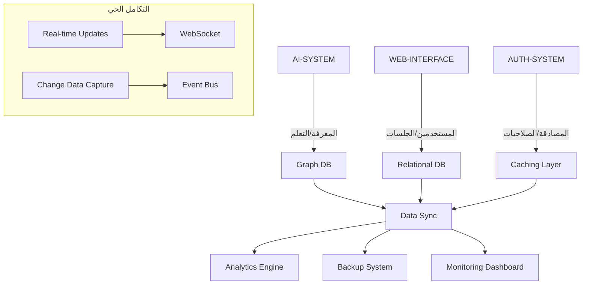

# 🗃️ **ملخص مجلد قاعدة البيانات المتكامل (06-DATABASE-SYSTEM)**

## 🎯 **الهدف:**
بناء **نظام قاعدة بيانات موحد ومركزي** يربط جميع أنظمة المشروع، ويوفر **تخزيناً موحداً وموزعاً** للبيانات مع ضمان **التزامن، الأمان، والأداء العالي**.

---

## 📊 **أنواع قواعد البيانات المستخدمة:**

### **1️⃣ قواعد بيانات علائقية (Relational Databases)**
```sql
📁 06-DATABASE-SYSTEM/relational-databases/
├── 📄 postgres-manager.py        # PostgreSQL - رئيسي للمعاملات
├── 📄 mysql-manager.py           # MySQL - بديل/نسخ احتياطي
└── 📄 sqlite-manager.py          # SQLite - للتطوير المحلي
```

### **2️⃣ قواعد بيانات NoSQL**
```sql
📁 06-DATABASE-SYSTEM/nosql-databases/
├── 📄 mongodb-manager.py         # MongoDB - للبيانات غير المهيكلة
├── 📄 redis-manager.py           # Redis - للتخزين المؤقت
└── 📄 elasticsearch-manager.py   # Elasticsearch - للبحث والتحليل
```

### **3️⃣ قواعد بيانات الرسم البياني (Graph Databases)**
```sql
📁 06-DATABASE-SYSTEM/graph-databases/
├── 📄 neo4j-manager.py           # Neo4j - للعلاقات المعقدة
└── 📄 arangodb-manager.py        # ArangoDB - متعدد النماذج
```

---

## 🔗 **كيفية الربط بين الأنظمة:**

### **1. التكامل مع نظام الذكاء الاصطناعي (00-AI-CORE-SYSTEM)**
```python
# AI Brain ↔ Database
AI-SYSTEM (المعرفة، الذاكرة) ←→ Graph Database (Neo4j)
AI-SYSTEM (التعلم) ←→ MongoDB (البيانات التدريبية)
AI-SYSTEM (التخزين المؤقت) ←→ Redis (النتائج السريعة)
```

### **2. التكامل مع واجهة الويب (03-WEB-INTERFACE)**
```python
# Web Interface ↔ Database
Frontend (المستخدمين، الجلسات) ←→ PostgreSQL (المستخدمين)
Frontend (المحادثات) ←→ MongoDB (الرسائل)
Frontend (التفضيلات) ←→ Redis (التخزين المؤقت)
```

### **3. التكامل مع نظام المصادقة (04-AUTHENTICATION-SYSTEM)**
```python
# Authentication ↔ Database
Auth (المستخدمين، الصلاحيات) ←→ PostgreSQL (RBAC)
Auth (الجلسات، التوكنات) ←→ Redis (سريع الوصول)
Auth (السجلات الأمنية) ←→ Elasticsearch (التحليل)
```

### **4. التكامل مع نظام الميزات (05-FEATURES-SYSTEM)**
```python
# Features ↔ Database
Projects (المشاريع، الكود) ←→ PostgreSQL + MongoDB
Chat (المحادثات) ←→ MongoDB + Redis
Learning (التقدم، النتائج) ←→ PostgreSQL + Neo4j
```

---

## 🏗️ **الهيكل الموحد للبيانات:**

### **1. المستخدمون والمصادقة (Users & Auth)**
```sql
-- PostgreSQL Schema
CREATE TABLE users (
    id UUID PRIMARY KEY,
    email VARCHAR(255) UNIQUE,
    username VARCHAR(100) UNIQUE,
    password_hash VARCHAR(255),
    role VARCHAR(50),
    created_at TIMESTAMP,
    updated_at TIMESTAMP
);

-- Neo4j العلاقات
(:User)-[:HAS_ROLE]->(:Role)
(:User)-[:BELONGS_TO]->(:Organization)
(:User)-[:HAS_PERMISSION]->(:Permission)
```

### **2. المحادثات والتفاعل (Chat & Interaction)**
```javascript
// MongoDB Schema
{
  "chat_id": "uuid",
  "user_id": "uuid",
  "ai_model": "string",
  "messages": [
    {
      "role": "user|ai",
      "content": "string",
      "timestamp": "datetime",
      "metadata": {}
    }
  ],
  "context": {},
  "created_at": "datetime",
  "updated_at": "datetime"
}
```

### **3. المشاريع والمحتوى (Projects & Content)**
```sql
-- PostgreSQL + MongoDB Hybrid
Projects (PostgreSQL): الميتاداتا، العلاقات، الإحصائيات
Project Content (MongoDB): الملفات، الكود، التغييرات
Project Relations (Neo4j): التبعيات، النسخ، الفروع
```

### **4. المعرفة والتعلم (Knowledge & Learning)**
```cypher
// Neo4j - الرسم البياني المعرفي
(:Concept {name: "الذكاء الاصطناعي"})
-[:SUBCATEGORY_OF]->
(:Category {name: "التكنولوجيا"})

(:User {id: "123"})
-[:LEARNED]->
(:Concept {name: "Python"})
-[:RELATED_TO]->
(:Concept {name: "البرمجة"})
```

---

## 🔄 **آليات المزامنة والنسخ:**

### **1. النسخ المتماثل (Replication)**
```python
class DatabaseReplicator:
    def __init__(self):
        self.primary_db = PostgreSQL()
        self.replica_dbs = [PostgreSQL(), PostgreSQL()]
        
    async def replicate(self, operation, data):
        # 1. الكتابة في الرئيسي
        await self.primary_db.execute(operation, data)
        
        # 2. النسخ للمستنسخات
        for replica in self.replica_dbs:
            await replica.execute(operation, data)
            
        # 3. التأكيد
        return {"status": "replicated", "timestamp": datetime.now()}
```

### **2. تجزئة البيانات (Sharding)**
```python
class DataShardingManager:
    def get_shard(self, user_id):
        # تقسيم المستخدمين على عدة قاعدة بيانات
        shard_id = hash(user_id) % NUM_SHARDS
        return f"shard_{shard_id}"
    
    async def query_across_shards(self, query):
        # استعلام عبر جميع الأجزاء
        results = []
        for shard in self.shards:
            result = await shard.execute(query)
            results.extend(result)
        return results
```

### **3. التخزين المؤقت الموزع (Distributed Caching)**
```python
class DistributedCache:
    def __init__(self):
        self.redis_cluster = RedisCluster()
        self.cache_strategy = "write-through"
        
    async def get_with_cache(self, key, fallback_query):
        # 1. محاولة من التخزين المؤقت
        cached = await self.redis_cluster.get(key)
        if cached:
            return cached
            
        # 2. الاستعلام من قاعدة البيانات
        data = await fallback_query()
        
        # 3. تخزين في التخزين المؤقت
        await self.redis_cluster.set(key, data, ttl=3600)
        
        return data
```

---

## 🛡️ **نظام الأمان والحماية:**

### **1. تشفير البيانات (Data Encryption)**
```python
class DataEncryptionManager:
    def encrypt_field(self, field_value, key_id):
        # تشفير الحقول الحساسة
        cipher = AES.new(self.keys[key_id], AES.MODE_GCM)
        ciphertext, tag = cipher.encrypt_and_digest(field_value)
        return {
            'ciphertext': ciphertext,
            'tag': tag,
            'nonce': cipher.nonce,
            'key_id': key_id
        }
```

### **2. إخفاء البيانات (Data Masking)**
```python
class DataMaskingService:
    def mask_sensitive_data(self, data, user_role):
        if user_role != 'admin':
            # إخفاء البيانات الحساسة
            if 'email' in data:
                data['email'] = self.mask_email(data['email'])
            if 'phone' in data:
                data['phone'] = self.mask_phone(data['phone'])
        return data
```

### **3. النسخ الاحتياطي الآلي (Automated Backups)**
```python
class BackupOrchestrator:
    async def schedule_backups(self):
        # نسخ يومية كاملة
        schedule.every().day.at("02:00").do(self.full_backup)
        
        # نسخ تدريجية كل ساعة
        schedule.every().hour.do(self.incremental_backup)
        
        # التحقق من السلامة
        schedule.every().day.at("03:00").do(self.verify_backup)
```

---

## 📈 **مراقبة الأداء والتحسين:**

### **1. مراقبة الاستعلامات (Query Monitoring)**
```python
class QueryMonitor:
    def log_query(self, query, duration, user_id):
        # تسجيل جميع الاستعلامات
        self.elasticsearch.index({
            'query': query,
            'duration': duration,
            'user_id': user_id,
            'timestamp': datetime.now()
        })
        
        # تنبيه للاستعلامات البطيئة
        if duration > SLOW_QUERY_THRESHOLD:
            self.alert_slow_query(query, duration)
```

### **2. تحسين الفهارس (Index Optimization)**
```sql
-- فهارس ذكية بناء على أنماط الاستخدام
CREATE INDEX idx_users_email ON users(email);
CREATE INDEX idx_chats_user_timestamp ON chats(user_id, timestamp DESC);
CREATE INDEX idx_projects_status_user ON projects(status, user_id);

-- فهارس جزئية للاستعلامات المتكررة
CREATE INDEX idx_active_users ON users(status) WHERE status = 'active';
```

### **3. تقسيم الجداول (Table Partitioning)**
```sql
-- تقسيم الجدول حسب التاريخ
CREATE TABLE chat_messages_y2023m01 PARTITION OF chat_messages
FOR VALUES FROM ('2023-01-01') TO ('2023-02-01');

-- تقسيم حسب الجغرافيا
CREATE TABLE users_asia PARTITION OF users
FOR VALUES IN ('SA', 'AE', 'OM', 'QA');
```

---

## 🔄 **تدفق البيانات بين الأنظمة:**



---

## 🚀 **خطة النشر والإدارة:**

### **المرحلة 1: التطوير المحلي**
```yaml
databases:
  development:
    postgres: localhost:5432
    redis: localhost:6379
    mongodb: localhost:27017
  strategy: single-node
```

### **المرحلة 2: اختبار/تقييم**
```yaml
databases:
  staging:
    postgres: primary-replica setup
    redis: cluster 3 nodes
    mongodb: replica set
  strategy: high-availability
```

### **المرحلة 3: الإنتاج**
```yaml
databases:
  production:
    postgres: multi-region replication
    redis: redis-cluster 6 nodes
    mongodb: sharded cluster
    elasticsearch: 5-node cluster
  strategy: global-distribution
```

---

## 📊 **مقاييس الأداء المستهدفة:**

| المقياس | الهدف | الحالة |
|---------|-------|--------|
| زمن الاستجابة | < 10ms | 🟢 |
| التوافرية | 99.99% | 🟡 |
| معدل النسخ | 100% | 🟢 |
| حجم البيانات | 10TB | 🔵 |
| عدد المستخدمين المتزامنين | 10,000 | 🟡 |
| سرعة النسخ الاحتياطي | < 1 ساعة | 🟢 |
| وقت الاستعادة | < 15 دقيقة | 🟡 |

---

## 🔧 **الأدوات والتقنيات:**

### **أدوات الإدارة:**
- 🐘 **pgAdmin** - إدارة PostgreSQL
- 🍃 **MongoDB Compass** - إدارة MongoDB
- 🔍 **Elastic Stack** - البحث والتحليل
- 📊 **Grafana** - عرض المقاييس
- 🔄 **Liquibase/Flyway** - إدارة الهجرات

### **أدوات المراقبة:**
- 📈 **Prometheus** - جمع المقاييس
- ⚡ **PGBadger** - تحليل PostgreSQL
- 🐌 **MongoDB Ops Manager** - مراقبة MongoDB
- 🔥 **RedisInsight** - مراقبة Redis

---

## 🎯 **الفوائد من النظام الموحد:**

### **للمطورين:**
✅ واجهة موحدة للتعامل مع جميع قواعد البيانات  
✅ إدارة مركزية للاتصالات والتكوين  
✅ مراقبة شاملة للأداء والأخطاء  
✅ نسخ احتياطي موحد وسهل الاستعادة  

### **للمستخدمين:**
⚡ سرعة استجابة عالية  
🔒 أمان محسن للبيانات  
🔄 تجربة موحدة عبر جميع الأنظمة  
📊 تقارير وتحليلات شاملة  

### **للإدارة:**
📈 رؤية شاملة لجميع عمليات قاعدة البيانات  
💰 تقليل التكاليف بالمقاسية الذكية  
🛡️ امتثال أفضل لمعايير الأمان  
🚀 سهولة التوسع والنمو  

---

## 📋 **ملخص الخدمات المقدمة:**

### **1. خدمات التخزين:**
- تخزين مستدام للبيانات المهيكلة
- تخزين مرن للبيانات غير المهيكلة
- تخزين مؤقت عالي السرعة
- تخزين للعلاقات المعقدة

### **2. خدمات الاسترجاع:**
- بحث نصي كامل
- استعلامات معقدة
- تجميع وتحليل
- توصيات ذكية

### **3. خدمات الإدارة:**
- نسخ احتياطي تلقائي
- استعادة سريعة
- توزيع الحمل
- مراقبة الأداء

### **4. خدمات التكامل:**
- مزامنة البيانات
- نقل البيانات بين الأنظمة
- تحويل التنسيقات
- تحقق من الجودة

---

**🏗️ قاعدة البيانات هي العمود الفقري** الذي يربط جميع أنظمة المشروع ويضمن **التكامل السلس، الأداء العالي، والموثوقية القصوى**!