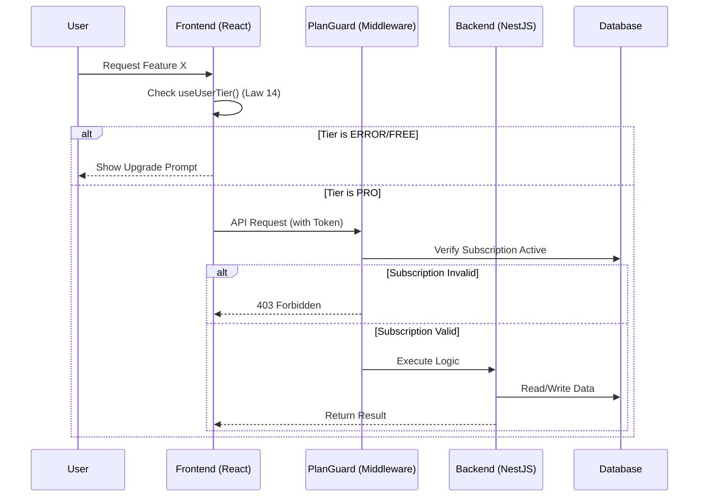

# 03_FEATURES: Feature Specifications Repository

This directory contains the "Source of Truth" for all system features. Each feature must be documented with a focus on Data Flow and Plan Sovereignty as defined in `Laws 14` and `10`.

## 📝 Feature Specification Template (Use for new features)

### [ID] Feature Name

#### 1. Overview
Brief description of the feature.

#### 2. Data Flow Sequence Diagram (مخطط تسلسل البيانات)
**CRITICAL:** Diagram must show "Plan Check" (Law 14) and "Permission Check" (Law 10).

#### 3. Plan Sovereignty Analysis (Law 14)
- **Free Tier:** What is visible? What is blocked?
- **Pro Tier:** Limits.
- **Premium Tier:** Full access.

#### 4. Security Constraints (Law 10)
- List specific permissions required.
- **NOTE:** 'Teacher' role is invalid. Do not mention it.
