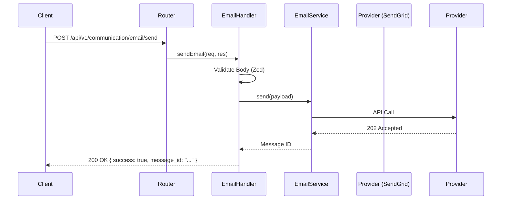

# الهيكلية والمفاهيم 🏗️

تتبع وحدة التواصل **هيكلية القنوات (Channel-Based Architecture)**، المصممة لفصل *بروتوكول* الاتصال (بريد إلكتروني، رسائل نصية) عن *منطق العمل*.

## نمط القناة (The Channel Pattern)

بدلاً من وجود `NotificationService` ضخم يتعامل مع كل شيء، نعامل كل وسيلة اتصال كـ **قناة (Channel)** مستقلة.

### المكونات

1.  **المعالج (Handler - طبقة العرض)**:
    *   الموقع: `channels/<channel_name>/<Channel>Handler.ts`.
    *   المسؤولية: تحليل طلبات HTTP، التحقق من المدخلات باستخدام Zod، واستدعاء الخدمة.
    *   يجب أن يرث من `BaseCommunicationHandler`.

2.  **الخدمة (Service - طبقة التطبيق/المجال)**:
    *   تحتوي على المنطق الفعلي لإرسال الرسالة (مثلاً التحدث مع `nodemailer` أو `twilio` sdk).
    *   يتم حقنها في المعالج عبر حقن التبعية (Dependency Injection).

3.  **المسار (Route - طبقة الشبكة)**:
    *   يربط نقاط HTTP بأساليب المعالج.
    *   الموقع: `routes/features/communication/`.

## تدفق البيانات (Data Flow)

## مبادئ التصميم

### 1. التوحيد المعياري (Standardization)
تُرجع جميع المعالجات ردود JSON متسقة للنجاح والفشل.
*   **إرسال متزامن**: يُرجع `message_id` و `provider`.
*   **طابور غير متزامن**: يُرجع `job_id` و `status: "queued"`.

### 2. التحقق أولاً (Validation First)
نستخدم **Zod** بشكل صارم للتحقق من المخطط. لا يُسمح باستخدام `any` في المعالجات.
يتم تنظيف المدخلات وتحديد نوعها *قبل* الوصول لطبقة الخدمة.

### 3. القابلية للتوسع (Extensibility)
لإضافة قناة **WhatsApp**:
1.  أنشئ `channels/whatsapp/WhatsappHandler.ts`.
2.  عرّف `sendWhatsappSchema` في `whatsapp.schema.ts`.
3.  مدد `BaseCommunicationHandler`.
4.  سجّل المسارات.
*لا يتطلب ذلك أي تغيير في كود البريد الإلكتروني أو الرسائل النصية الموجود.*
